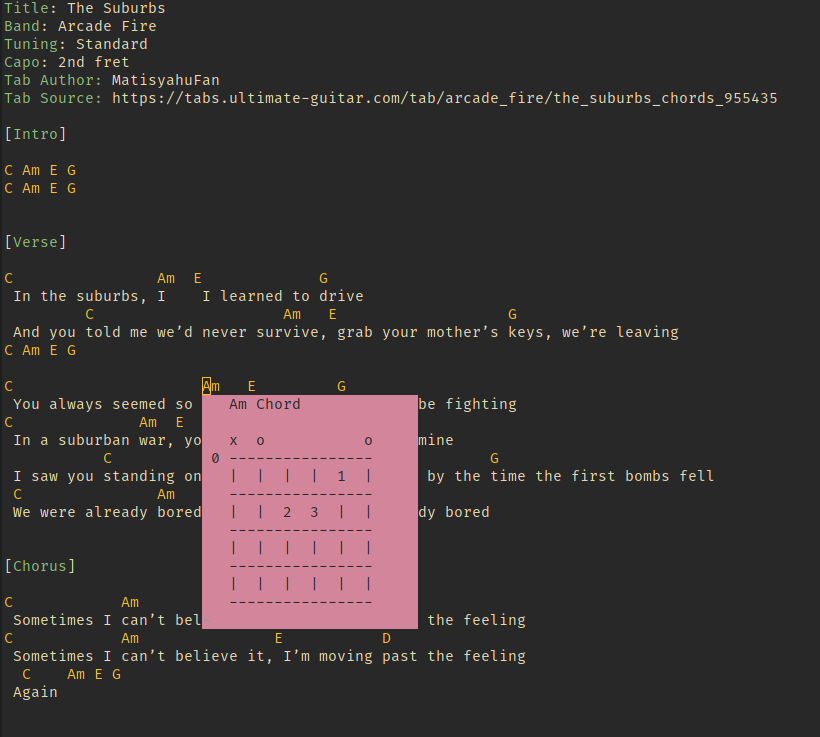

# vim-guitar-tab

A simple, experimental guitar tab viewer in NeoVim.

## Features

* Syntax highlighting
* Floating chord diagrams
* Built in chord database

## TODO

These are things I plan to implement:

* Navigate through chord alternatives
* Highlight of tablature
* Autoscroll
* Chord definitions: scan for chord diagrams in file in various format
    * e.g. C x32010 
    * e.g. chord diagram (both vertical and horizontal formats)
* Display barred strings as a line
* Don't show string state line if there is none

